# IPL_Visuvalisation-Hub-Unveiling-the-Cricket-Carnival-with-Data
# IPL_Analysis

Dive into the heartbeat of the Indian Premier League (IPL) with our ball-by-ball data analysis extravaganza! We've scraped through the web to bring you the juiciest cricket details, now served on an interactive Streamlit webpage. But that's not all – Power BI dashboards join the party, adding a dash of flair to visualize the IPL insights like never before. Get ready for a cricket feast where every ball tells a story!

## Table of Contents
- [Project Overview](#project-overview)
- [Data Collection](#data-collection)
- [Web Scraping](#web-scraping)
- [Streamlit Webpage](#streamlit-webpage)
- [Power BI Dashboards](#power-bi-dashboards)
- [Team Pages](#team-pages)

## To Visit the Webpage
[Streamlit Page Link](https://iplanalysis-2022.streamlit.app/)

## Project Overview

This project entails a meticulous analysis of ball-by-ball data sourced from the Indian Premier League (IPL). Employing web scraping techniques, we've diligently collected this data to construct an engaging and interactive webpage utilizing Streamlit. In addition, we've seamlessly integrated Power BI dashboards to elevate the depth and breadth of our visual insights.

## Data Collection

The ball-by-ball data for IPL matches was collected from [source website] using web scraping techniques. The data includes information on matches, players, runs, wickets, and more.

## Web Scraping

The web scraping initiative encompassed the extraction of pertinent information from the source website. Leveraging Python libraries, specifically BeautifulSoup and requests, we meticulously scraped and parsed the data. Subsequently, a meticulous cleaning and processing phase ensued to refine the scraped data, ensuring its readiness for subsequent in-depth analysis.

## Power BI Dashboards

Power BI dashboards have been integrated to provide a more comprehensive view of the IPL data. The dashboards include additional visualizations and insights that complement the analysis done in Streamlit.

## Team Pages
<p float="left">
  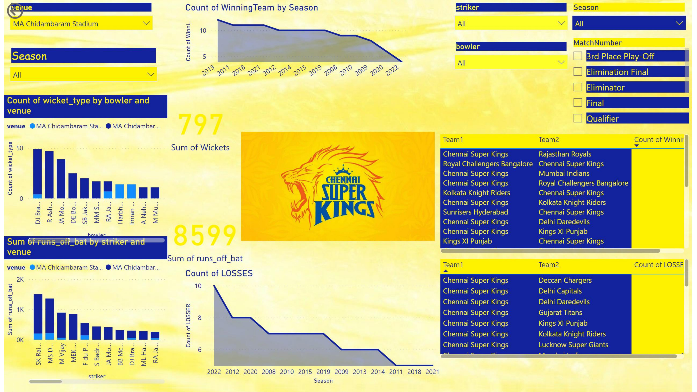
  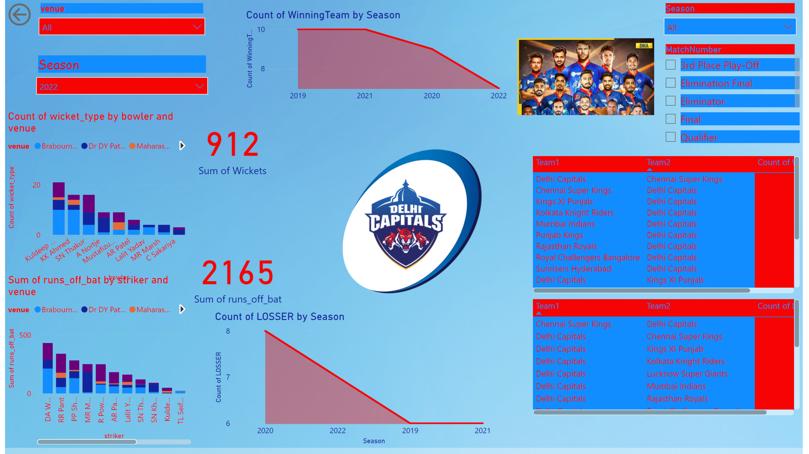
</p>
<p float="left">
  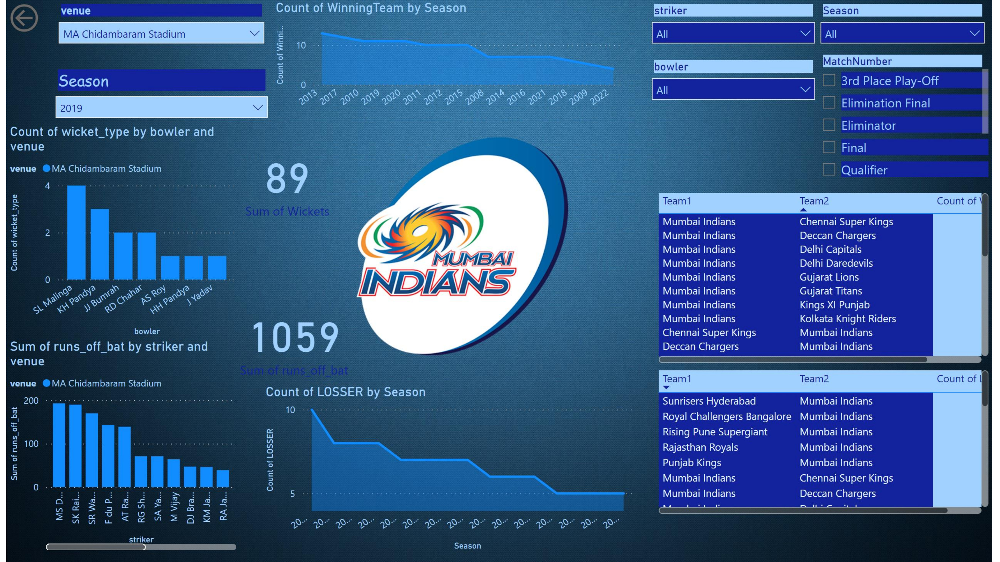
  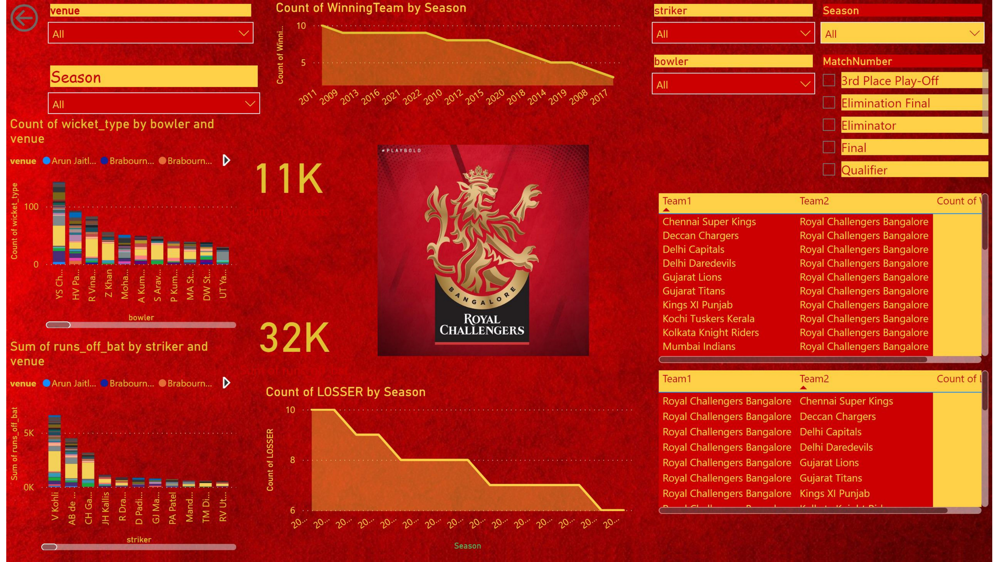
</p>
<p float="left">
  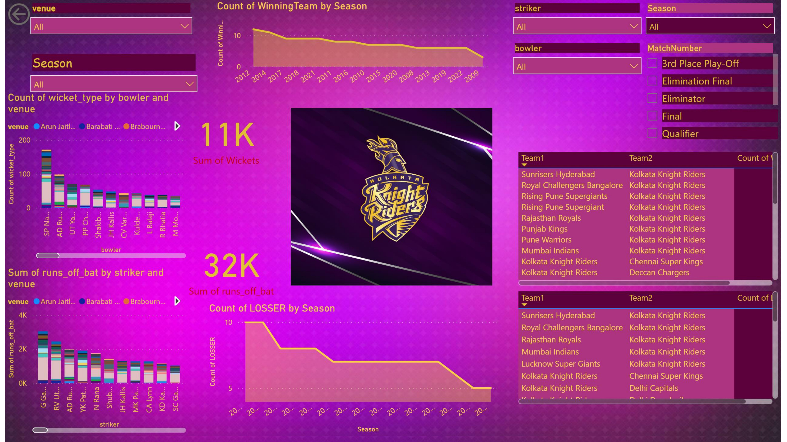
  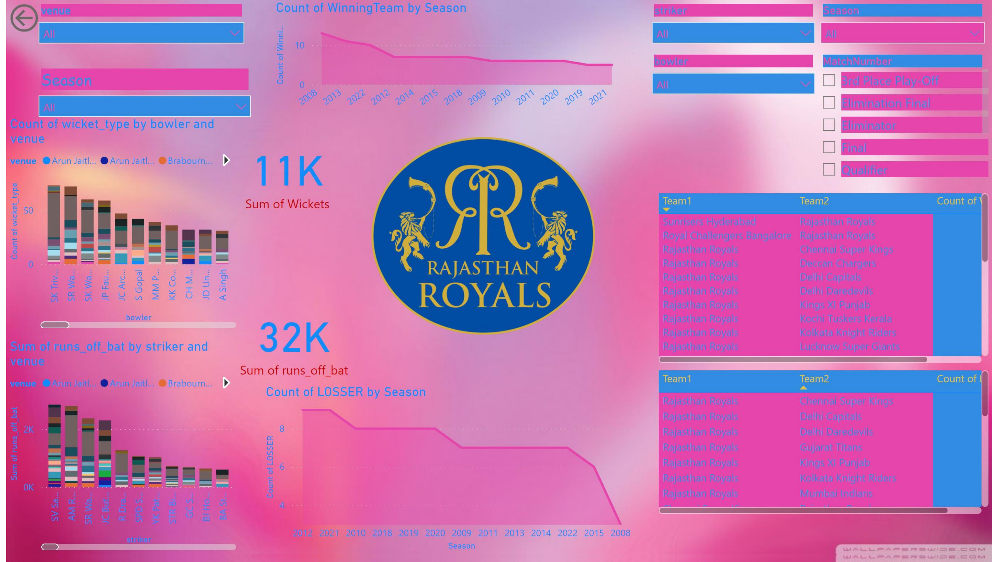
</p>
<p float="left">
  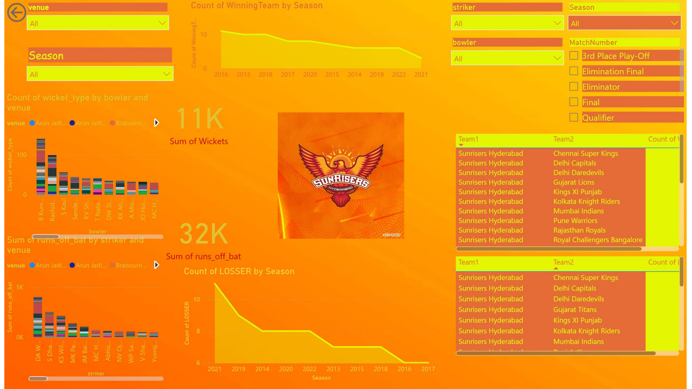
  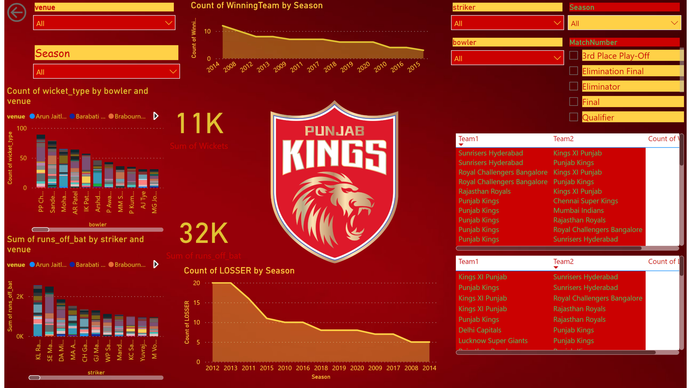
</p>
<p float="left">
  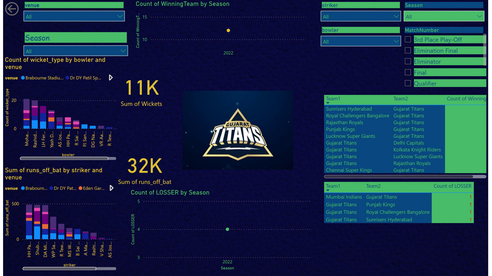
  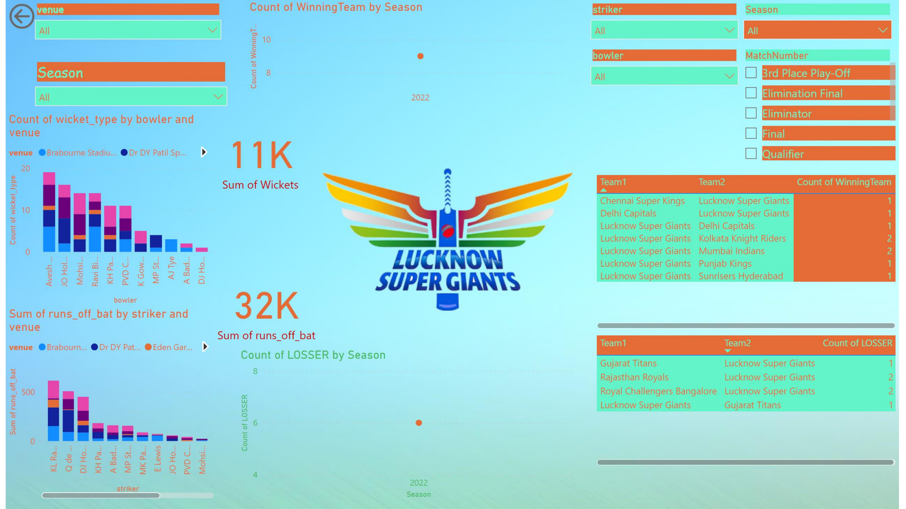
</p>

## Streamlit Webpage

The culmination of our analysis is elegantly showcased in an interactive webpage meticulously crafted with Streamlit. Tailored to perfection, each team boasts a dedicated page featuring team-specific insights, detailed player performances, and more. Navigate through the treasure trove of information using our user-friendly interactive widgets and visually appealing visualizations for a truly immersive experience.
<p float="left">
  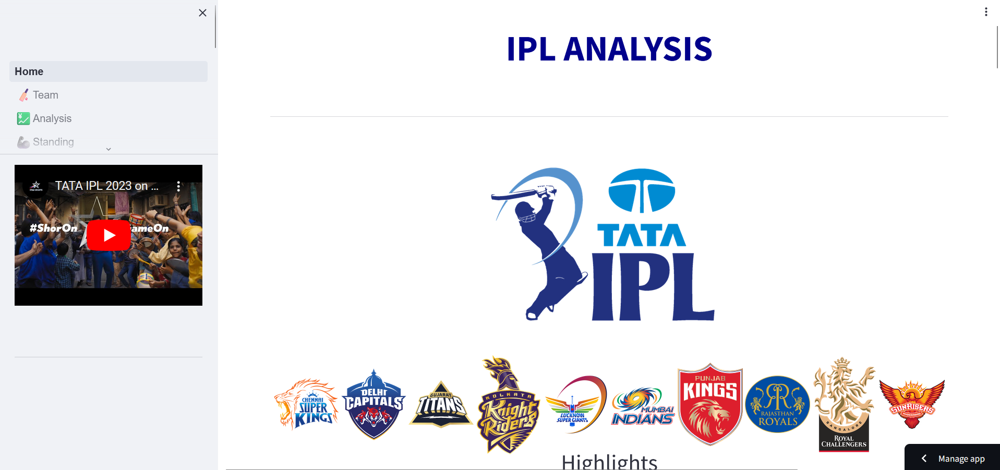
  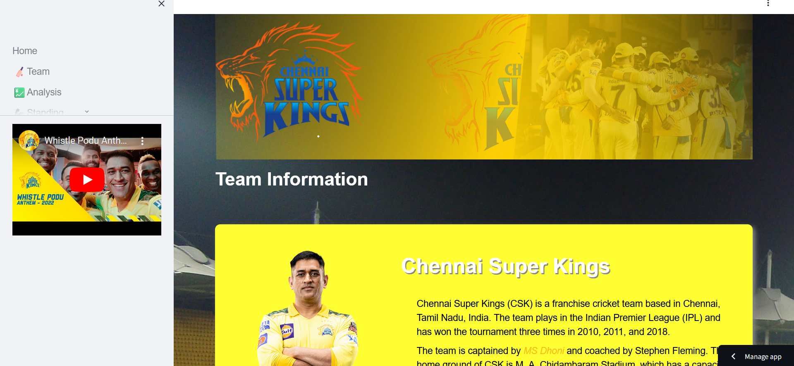
</p>
<p float="left">
  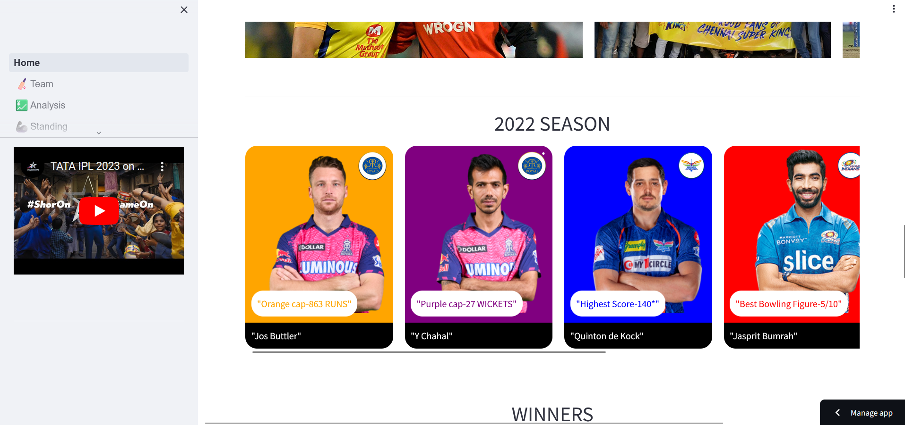
  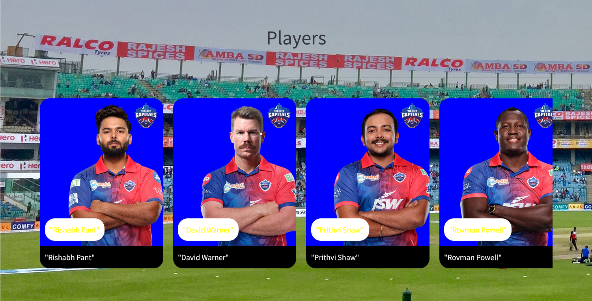
</p>

To run the Streamlit app locally, use the following command:

```bash
streamlit run Home.py
```
